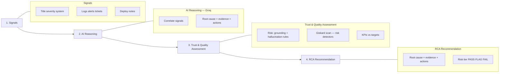
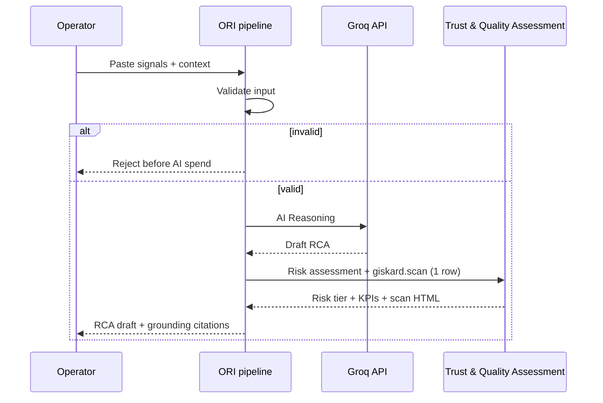

# ORI — Operational Reasoning Intelligence

**Business story (one line):**

**Signals → AI Reasoning → Trust & Quality Assessment → RCA Recommendation**

ORI ingests operational signals, uses **one Groq call** per incident for RCA, runs a **trust & quality assessment** (risk, not correctness proof), and returns a structured recommendation (cause, evidence, next steps).

---

## Quick start (new user — run in this order)

| Step | Command | Needs `GROQ_API_KEY`? | What it does |
|------|---------|----------------------|--------------|
| 1 | `python -m venv .venv` then activate | No | Virtual environment |
| 2 | `pip install -r requirements.txt` | No | Dependencies |
| 3 | `copy .env.example .env` → set `GROQ_API_KEY` | — | Config |
| 4 | `python main.py --mode validate-input` | No | Input gate regression |
| 5 | `python datasets/download.py` | No | Fills `data/raw/` |
| 6 | `python main.py --mode seed` | No* | `data/processed/` + `data/chromadb/` |
| 7 | `python main.py --mode ui` | **Yes** | Streamlit demo |

\*Seed uses local embeddings only. Optional before step 6: `python main.py --mode generate-synthetic` (Groq, for governance pool).

**Fastest demo after steps 1–3:** `python main.py` (uses `data/synthetic/sample_incident.json`, 1 Groq call).

**Fix garbled titles (`â€"` in related incidents):** re-run `python main.py --mode seed` after pulling latest code so ChromaDB metadata is re-normalized.

---

## `main.py` modes (reference)

| Mode / command | Example | Purpose |
|----------------|---------|---------|
| **run** (default) | `python main.py` | CLI RCA on sample incident |
| **run** + file | `python main.py --incident-file testcases/p1_critical_outage.json` | CLI RCA on your JSON |
| **ui** | `python main.py --mode ui` | Operator UI (KPIs, trust, Giskard HTML, RCA) |
| **api** | `python main.py --mode api` | REST API for integrations |
| **seed** | `python main.py --mode seed` | Build incident repository (ChromaDB) |
| **seed** dry | `python main.py --mode seed --dry-run` | Preview counts, no vector write |
| **validate-input** | `python main.py --mode validate-input` | Regression on `testcases/input_validation.json` |
| **generate-synthetic** | `python main.py --mode generate-synthetic` | ~50 incidents for governance eval |
| **giskard-scan** | `python main.py --mode giskard-scan` | Batch trust KPIs + `reports/giskard_scan.html` |
| **giskard-scan** fresh | `... --eval-fresh` | Re-run Groq on eval sample |
| **test** | `python main.py --mode test` | `pytest` suite |

**Groq usage per live RCA:** **1 call** (`layers/reasoning/chain.py`, prompt `UNIFIED_RCA_PROMPT`). Giskard `predict()` does not call Groq again.

**Sidebar “Incident repository: N”:** `N` = incidents in ChromaDB used for similar-history retrieval (not your current form submission).

---

## Trust & quality assessment — not “validation”

**Do not label step 3 as “Validation → PASS”.** Giskard and ORI trust rules evaluate **risk** (grounding, hallucination, detector signals) — they do **not** certify that the root cause is **correct**.

| Example | What ORI might return | Trust outcome | Correct? |
|---------|----------------------|---------------|----------|
| DB timeouts in signals | “Database saturation” | **PASS** (grounded, plausible) | Maybe not — true cause could be **connection pool exhaustion** |

Use language: **Trust & Quality Assessment**, **risk tier** (PASS / FLAG / FAIL), not “validated correct”.

---

## Measurable KPIs (SDK & integrations)

ORI exposes **machine-readable KPIs** so you can prove the POC in dashboards, tickets, or executive slides — not only PASS/FLAG/FAIL badges.

### What “SDK” means in this repo

| Layer | SDK / surface | Role |
|-------|----------------|------|
| **LLM** | [Groq Python SDK](https://github.com/groq/groq-python) (`layers/reasoning/chain.py`) | **1** `chat.completions` call per live RCA (`UNIFIED_RCA_PROMPT`) |
| **ORI Python** | `run_enterprise_rca()` in `layers/pipeline/enterprise.py` | Full pipeline + `trust_kpis` object |
| **ORI REST** | `POST /api/incidents/analyze` (`api/routes/incidents.py`) | `RCAReport` JSON for integrations |
| **Trust math** | `compute_trust_kpis()` in `layers/validation/trust_kpis.py` | KPI targets, observed values, on-target flags |

Giskard’s `predict()` does **not** call Groq again — it reuses the RCA already produced.

---

### Business KPI targets (executive)

| KPI | Target | Auto-measured live? | Where |
|-----|--------|-------------------|--------|
| **RCA draft time** | < 2 min | **Yes** | `total_latency_ms` / `trust_kpis.kpis[]` |
| **Hallucination rate** | < 5% | **Yes** (per incident + batch) | `hallucination_detected`, governance sample |
| **Grounded evidence rate** | > 90% | **Yes** | `grounding_audit` → `trust_kpis` |
| **Manual investigation reduction** | 40% | **Pilot** | Your ITSM / MTTR baseline vs ORI-assisted runs |
| **RCA acceptance rate** | > 80% | **Pilot** | Operator “accept draft” in ticket or survey |

**Risk vs correctness:** KPIs above measure **speed, grounding, and hallucination risk**. They do **not** prove the root cause is factually correct. Use `label_alignment_score` only when `true_root_cause` exists in labelled data.

---

### Per-incident KPI object (`trust_kpis`)

Every successful run through `run_enterprise_rca()` (UI, CLI, or Python) includes a **`trust_kpis`** block:

```json
{
  "disclaimer": "PASS/FLAG/FAIL measure risk — not correctness…",
  "risk_tier": "PASS",
  "trust_badge": "PASS",
  "label_alignment_score": 0.38,
  "label_alignment_note": "Compared to labelled root cause…",
  "kpis": [
    {
      "kpi": "RCA draft time",
      "target": "< 2 min",
      "observed": "1.6s",
      "observed_value": 1.6,
      "met": true,
      "scope": "this_run"
    },
    {
      "kpi": "Hallucination rate",
      "target": "< 5%",
      "observed": "0% (this incident)",
      "observed_value": 0.0,
      "met": true,
      "scope": "this_run"
    },
    {
      "kpi": "Grounded evidence rate",
      "target": "> 90%",
      "observed": "100%",
      "observed_value": 1.0,
      "met": true,
      "scope": "this_run"
    }
  ]
}
```

| Field | Meaning |
|-------|---------|
| `observed_value` | Numeric value for charts (seconds or 0–1 ratio) |
| `met` | `true` / `false` / `null` (`null` = pilot metric, not computed in POC) |
| `scope` | `this_run` (live) vs `production` (track in your ops tooling) |

**How each live KPI is calculated** (`layers/validation/trust_kpis.py`):

| KPI | Calculation |
|-----|-------------|
| RCA draft time | `total_latency_ms / 1000` (end-to-end pipeline, including memory + trust + Giskard) |
| Hallucination rate | `1.0` if `hallucination_detected` else `0.0` for this incident |
| Grounded evidence rate | Share of `evidence` lines marked `yes` or `partial (historical)` in `grounding_audit` |
| Label alignment (proxy) | Token overlap between `probable_root_cause` and `true_root_cause` when label present |

---

### Python SDK usage (full KPI payload)

```python
import asyncio
from config.settings import get_settings
from layers.pipeline.enterprise import run_enterprise_rca

settings = get_settings()
raw = {
    "title": "Revenue Dashboard Unavailable - P1",
    "description": "…",
    "severity": "P1",
    "affected_system": "revenue-dashboard",
    "signals": ["ERROR … pool exhausted"],
}

result = asyncio.run(run_enterprise_rca(raw, settings, source_dataset="sdk"))
print(result["trust_kpis"])          # business KPI table
print(result["total_latency_ms"])    # draft time (ms)
print(result["giskard_badge"])       # risk tier PASS | FLAG | FAIL
print(result["grounding_audit"])     # per-evidence citations
```

CLI writes the full dict to `reports/live_<incident_id>.json` after `python main.py`.

---

### REST API metrics (`RCAReport`)

`POST /api/incidents/analyze` returns `RCAReport` with core measurable fields:

| Field | Type | KPI / ops use |
|-------|------|----------------|
| `total_latency_ms` | int | RCA draft time (API path) |
| `confidence` | int | Model confidence 0–100 |
| `giskard_badge` | PASS/FLAG/FAIL | Risk tier |
| `hallucination_detected` | bool | Incident-level hallucination flag |
| `grounding_score` | float | 0–1 trust grounding score |
| `pipeline_trace` | object | `memory_ms`, `reasoning_ms`, `validation_ms`, `giskard_live_ms`, `similar_count` |
| `validation_issues` | list[str] | Human-readable trust findings |

Start API: `python main.py --mode api` → `http://localhost:8000/docs` for OpenAPI.

For the full `trust_kpis` object in custom integrations, call `run_enterprise_rca()` from Python or extend the API response to pass through `result["trust_kpis"]`.

---

### Batch governance KPIs (`giskard-scan`)

`python main.py --mode giskard-scan` aggregates metrics on a **sample** (default 5 incidents) and writes:

| Output | KPIs inside |
|--------|-------------|
| `reports/governance_report.html` | Table: KPI vs target with ✓/✗ |
| `reports/governance_summary.json` | `trust_pass_rate`, `hallucination_rate`, `mean_grounding_score`, `mean_label_alignment`, `mean_reasoning_ms`, `business_kpis[]` |

Use this for **release / audit evidence**, not for every production ticket (saves Groq + scan cost).

---

### Logging KPIs for observability

Structured logs in `logs/ori.log` include:

- `groq.rca_generated` — `latency_ms`, `confidence`, `groq_calls=1`
- `pipeline.reasoning_complete` — reasoning segment timing
- `trust.validation` — `badge`, `grounding`, `issues_count`
- `api.analyze_complete` — `latency_ms`, `badge`

Ship these fields to your log stack to build **production** dashboards for investigation reduction and acceptance rate.

---

## Giskard — where it works and a reality check

| Question | Answer |
|----------|--------|
| **Does Giskard run on every UI click?** | **Yes (one incident).** After Groq RCA, ORI runs **`giskard.scan()` on a single row** (`layers/validation/live_giskard.py`). Giskard’s `predict()` returns the RCA already generated — **no extra Groq calls** for the scan. |
| **When does batch Giskard run?** | When **you** run `python main.py --mode giskard-scan` on a **sample** (default 5 incidents). Writes `reports/giskard_scan.html` for governance. |
| **What does live “Trust Layer” mean?** | **Giskard scan** + ORI grounding rules (`validator.py`, `report_validator.py`) + UI citations (`grounding_audit`). |
| **What does `giskard_badge` mean?** | **Risk tier** (PASS / FLAG / FAIL) — not correctness. Giskard detector issues appear separately in `giskard_scan` / embedded HTML. |
| **Can I disable live Giskard?** | Set `GISKARD_LIVE_SCAN=false` in `.env` (trust rules still run). |
| **Honest pitch for executives** | “Every RCA is checked with **Giskard on the ticket** plus batch evaluation on a sample before release.” |

**Code map**

| Path | Giskard library? | What runs |
|------|------------------|-----------|
| UI / API / `python main.py` | **Yes (1 row)** | Groq (**1 call**) → ORI trust rules → `giskard.scan()` → `reports/live_{id}_giskard.html` |
| `python main.py --mode giskard-scan` | **Yes (sample)** | Cached RCA on N incidents → `giskard.scan()` → `reports/giskard_scan.html` |

---

## What we do *not* use (removed from docs and code)

| Removed / not in architecture | Notes |
|------------------------------|--------|
| **LangChain / LCEL** | Removed. Reasoning is **Groq SDK** only (`layers/reasoning/chain.py`). |
| **Claude / `.claude/`** | Removed. Not part of ORI. |
| **Full Giskard on every synthetic row** | Not on UI path — batch mode samples **few** incidents to save API credits. |

**Still used (implementation detail, not slide fodder):** ChromaDB (similar incidents), sentence-transformers (embeddings), FastAPI, Streamlit.

---

## What you need before starting

| Requirement | Notes |
|-------------|--------|
| **Python 3.10+** | `python --version` |
| **Groq API key** | Free tier: [console.groq.com](https://console.groq.com) |
| **Git** | To clone the repository |
| **~2 GB disk** | Embeddings model + ChromaDB on first run |
| **Kaggle CLI** | Optional — only for IT-incidents download |

---

## Step-by-step setup (fill `data/` from empty)

Run these commands **from the project root** (`Operational_Reasoning_Intelligence/`).  
On Windows use **PowerShell**; activate the venv with `.venv\Scripts\activate`.

### Step 0 — Clone and enter the project

```bash
git clone <https://github.com/OFI-Summer-AI/Operational_Reasoning_Intelligence>
cd Operational_Reasoning_Intelligence
```

**`data/` right after clone (tracked in git):**

```
data/
├── .gitkeep
├── raw/.gitkeep          ← empty until Step 3
├── processed/.gitkeep    ← empty until Step 5
└── synthetic/
    ├── .gitkeep
    └── sample_incident.json   ← small demo file (committed)
```

Everything else under `data/` is created by scripts and listed in `.gitignore` (not committed).

---

### Step 1 — Python virtual environment

```bash
python -m venv .venv
```

**Windows (PowerShell):**

```powershell
.venv\Scripts\activate
```

**macOS / Linux:**

```bash
source .venv/bin/activate
```

You should see `(.venv)` in your prompt.

---

### Step 2 — Install dependencies

```bash
pip install -r requirements.txt
```

First run downloads `sentence-transformers` (~80 MB) when seeding or using memory.

---

### Step 3 — Configure environment

```bash
# Windows
copy .env.example .env

# macOS / Linux
cp .env.example .env
```

Open `.env` and set at minimum:

```env
GROQ_API_KEY=gsk_your_key_here
```

Other defaults are fine for local development. **Never commit `.env`** (it is in `.gitignore`).

---

### Step 4 — Verify input validation (no API key, no data)

Checks that incident forms are validated before Groq is called:

```bash
python main.py --mode validate-input
```

Expected: lines like `[PASS] ING-001 ...` and exit code 0.

---

### Step 5 — Download external datasets → `data/raw/`

```bash
python datasets/download.py
```

**What this script does:** `datasets/download.py` writes **source** files into `data/raw/`:

| Output | Source |
|--------|--------|
| `data/raw/pag_incidents.json` | HuggingFace sample (or placeholder) |
| `data/raw/hdfs_logs/HDFS_sample.log` | LogHub sample |
| `data/raw/it_incidents.json` | Kaggle (if `KAGGLE_USERNAME` / `KAGGLE_KEY` set) or placeholder |

**`data/` after Step 5:**

```
data/
├── raw/
│   ├── pag_incidents.json
│   ├── hdfs_logs/HDFS_sample.log
│   └── it_incidents.json      (may be placeholder)
├── processed/                 ← still empty
└── synthetic/sample_incident.json
```

---

### Step 6 (optional) — Generate synthetic eval pool → `data/synthetic/`

Needed only for **offline Giskard governance** (`giskard-scan`). Uses Groq (~50 incidents).

```bash
python main.py --mode generate-synthetic
```

**Creates:** `data/synthetic/synthetic_incidents.json` (gitignored — large, local only).

---

### Step 7 — Seed: raw → unified JSON → ChromaDB

This is the main step that fills **`data/processed/`** and **`data/chromadb/`**.

```bash
python main.py --mode seed
```

**What happens inside `main.py --mode seed`:**

1. **Parse** each file under `data/raw/` (+ synthetic pool if present).
2. **Normalise** to `UnifiedIncident` (Pydantic schema in `layers/ingestion/schema.py`).
3. **Write** one JSON file per source under `data/processed/`:
   - `pag_incidents.json`, `it_incidents.json`, `hdfs_logs.json`, `synthetic.json`, …
4. **Embed** all processed incidents with `all-MiniLM-L6-v2` and **upsert** into `data/chromadb/`.
5. **Cache** embeddings under `data/embedding_cache/` (speeds up re-runs).

Preview without writing to ChromaDB:

```bash
python main.py --mode seed --dry-run
```

**`data/` after Step 7:**

```
data/
├── raw/                    (unchanged — source of truth for re-seed)
├── processed/
│   ├── pag_incidents.json
│   ├── hdfs_logs.json
│   └── ...
├── chromadb/               ← vector database (local persistence)
├── embedding_cache/        ← hash → embedding JSON files
└── synthetic/
    ├── sample_incident.json
    └── synthetic_incidents.json   (if Step 6 ran)
```

Check the terminal for `seed.complete` and a non-zero incident count.

---

### Step 8 — Run RCA on the sample incident (CLI)

```bash
python main.py
```

Uses `data/synthetic/sample_incident.json` by default. Requires `GROQ_API_KEY`.

**Writes:** `reports/live_<incident_id>.json` (gitignored) and logs to `logs/ori.log`.

Or use a testcase:

```bash
python main.py --mode run --incident-file testcases/p1_critical_outage.json
```

---

### Step 9 — Start the web UI

```bash
python main.py --mode ui
```

Open the URL Streamlit prints (usually `http://localhost:8501`).  
On first load, the UI auto-seeds ChromaDB if empty (from `processed/` or synthetic pool).

Use **Severity labels** in the sidebar and paste fields from `testcases/testcase_01_*.md`, or run Step 8 JSON files.

---

### Step 10 (optional) — Offline Giskard governance

Requires Step 6 (`synthetic_incidents.json`). Does **not** run during UI analysis.

```bash
python main.py --mode giskard-scan
```

**Creates (gitignored):**

| Path | Purpose |
|------|---------|
| `reports/governance_summary.json` | KPIs |
| `reports/governance_report.html` | Human-readable summary |
| `reports/giskard_scan.html` | Official Giskard UI (if `GISKARD_USE_FULL_SCAN=true`) |
| `data/governance/rca_predictions.json` | Cached Groq RCAs for the eval sample |

Re-run with fresh Groq calls:

```bash
python main.py --mode giskard-scan --eval-fresh
```

---

### Step 11 (optional) — API server

```bash
python main.py --mode api
```

- Health: `http://localhost:8000/api/health`
- Analyze: `POST /api/incidents/analyze` with JSON body
- Docs: `http://localhost:8000/docs`

---

### Step 12 — Run tests

```bash
python main.py --mode test
```

---

## Quick reference — commands → `data/`

| Step | Command | Folders touched |
|------|---------|-----------------|
| 5 | `python datasets/download.py` | `data/raw/` |
| 6 | `python main.py --mode generate-synthetic` | `data/synthetic/synthetic_incidents.json` |
| 7 | `python main.py --mode seed` | `data/processed/`, `data/chromadb/`, `data/embedding_cache/` |
| 8–9 | `main.py` / `--mode ui` | `reports/`, `logs/` (live RCA only) |
| 10 | `python main.py --mode giskard-scan` | `reports/`, `data/governance/` |

---

## Architecture (business view)

This is the story for slides and stakeholders. Under the hood, “similar history” uses ChromaDB; that is an implementation detail, not a separate box on the slide.



### Step-by-step (what happens on each incident)

| Step | Business name | What ORI does | Giskard library? |
|------|---------------|---------------|-------------------|
| **1** | **Signals** | Validate required fields; normalize to one incident object | No |
| **2** | **AI Reasoning** | Similar past incidents from ChromaDB; **one Groq call** (correlate + RCA JSON) | No |
| **3** | **Trust & quality assessment** | Risk rules + **`giskard.scan()`** (not correctness proof) | **Yes** |
| **4** | **RCA Recommendation** | Confidence, trust badge, root cause, evidence, next steps, Giskard HTML | No |

**Offline trust (Giskard brand on slide):** run `python main.py --mode giskard-scan` on a **sample** of synthetic incidents → `reports/giskard_scan.html` for auditors.



### Design choices (aligned with the four-step story)

| Choice | Why |
|--------|-----|
| **Assess risk before you act** | Groq can hallucinate; trust assessment flags **grounding risk** — operators still verify correctness. |
| **Giskard per ticket + batch sample** | UI runs **one-row** `giskard.scan()` after RCA; batch mode samples **few** rows to limit Groq + scan cost. |
| **Groq SDK, not LangChain** | One unified prompt in `prompts.py` (`UNIFIED_RCA_PROMPT`). |
| **`data/raw` → `processed` → ChromaDB** | Reproducible history for “similar incidents” during AI reasoning. |
| **One entry point `main.py`** | Setup, UI, API, seed, and Giskard batch are explicit modes. |

### Technical diagram (optional)

Editable draw.io: [`diagrams/orip1_architecture.drawio`](diagrams/orip1_architecture.drawio) — engineering detail; slides should use the **four-step** diagram above.

---

## Repository layout

```
Operational_Reasoning_Intelligence/
├── main.py                 # All run modes
├── Procfile                # Railway: uvicorn api.main:app
├── .env.example            # Template — copy to .env
├── .gitignore
├── config/                 # settings.py, logging_config.py
├── api/                    # FastAPI
├── frontend/               # Streamlit + theme
├── layers/                 # ingestion, memory, reasoning, validation, output, pipeline
├── datasets/download.py    # → data/raw/
├── testcases/              # P1–P4 demos + input_validation.json
├── tests/                  # pytest
├── data/                   # See setup guide — mostly gitignored when filled
├── logs/                   # ori.log (gitignored)
├── reports/                # RCA + governance HTML (gitignored)
└── architecture_diagram/               # Optional engineering draw.io
```

---

## Test cases (`testcases/`)

| File | Severity | Use |
|------|----------|-----|
| `testcase_01_p1_critical_outage.md` + `p1_critical_outage.json` | P1 | Major outage |
| `testcase_02_p2_major_degradation.md` + `p2_major_degradation.json` | P2 | Degraded service |
| `testcase_03_p3_minor_issue.md` + `p3_minor_issue.json` | P3 | Minor issue |
| `testcase_04_p4_informational.md` + `p4_informational.json` | P4 | Informational |
| `testcase_05_ingestion_blocked.md` + `ingestion_blocked.json` | — | Must fail before Groq |
| `input_validation.json` | — | `validate-input` regression |

---

## What Git tracks vs ignores

| Tracked in git | Ignored (local / generated) |
|----------------|----------------------------|
| `data/.gitkeep`, `data/raw/.gitkeep`, `data/processed/.gitkeep` | Contents of `raw/`, `processed/` after download/seed |
| `data/synthetic/sample_incident.json` | `data/synthetic/synthetic_incidents.json` |
| `testcases/*` | `data/chromadb/`, `data/embedding_cache/` |
| `.env.example` | `.env`, `logs/`, `reports/` |
| Source code | `__pycache__/`, `.venv/`, `.pytest_cache/` |
| | `data/governance/`, `data/eval/` |

See [`.gitignore`](.gitignore) for the full list.

---

## Environment variables

| Variable | Default | Purpose |
|----------|---------|---------|
| `GROQ_API_KEY` | — | **Required** for RCA |
| `GROQ_MODEL` | `llama-3.3-70b-versatile` | Model |
| `CHROMADB_PERSIST_DIR` | `./data/chromadb` | Vector DB |
| `CHROMADB_COLLECTION_NAME` | `ori_incidents` | Collection name |
| `PROCESSED_DATA_DIR` | `./data/processed` | Unified JSON output |
| `RAW_DATA_DIR` | `./data/raw` | Downloaded datasets |
| `INPUT_VALIDATION_CASES_PATH` | `./testcases/input_validation.json` | Field regression |
| `GOVERNANCE_CACHE_PATH` | `./data/governance/rca_predictions.json` | Giskard eval cache |
| `LOG_FILE` | `./logs/ori.log` | Application log |
| `GISKARD_USE_FULL_SCAN` | `true` | `giskard.scan()` in batch mode |

---

## Trust badge (live)

| Badge | Meaning |
|-------|---------|
| `PASS` | Evidence grounded; no hallucinated components |
| `FLAG` | Weak grounding or report-level issues |
| `FAIL` | Component cited that does not appear in signals |

---

## Deployment

**Railway:** `Procfile` runs `uvicorn api.main:app`. Set env vars from `.env.example` and mount a volume at `CHROMADB_PERSIST_DIR=/data/chromadb`.

---

## Troubleshooting

| Problem | Fix |
|---------|-----|
| `processed/` empty | Run `python main.py --mode seed` after `datasets/download.py` |
| ChromaDB count 0 in UI | Run seed, or ensure `processed/` has JSON files |
| No similar incidents | Seed DB; broaden signal keywords in the query |
| Groq auth error | Check `GROQ_API_KEY` in `.env` |
| Old collection name | Set `CHROMADB_COLLECTION_NAME=ori_incidents` and re-seed |
